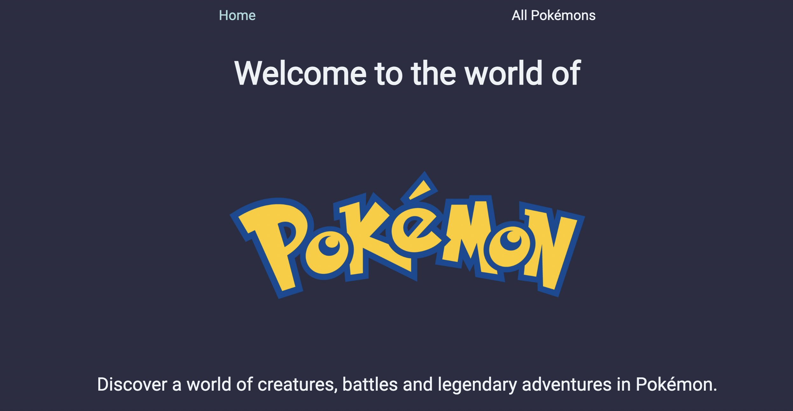

# Pokemon Web App

Discover a world of creatures, battles, and legendary adventures with the Pokémon Web App! This application allows you to search for and explore all Pokémon using a powerful API. Dive into the Pokémon universe, learn about each creature's abilities, types, and stats, and experience the thrill of Pokémon battles.

Whether you're a seasoned Trainer or new to the world of Pokémon, this app provides a seamless way to connect with your favorite characters and enhance your Pokémon journey. Get ready to catch them all!



# Installation & Usage

## Instalation

1. Clone the repository and navigate to the project directory:

```sh
git https://github.com/ECO786786/pokemon

```

2. Install the necessary dependencies:

```sh
npm install
```

3. Start the application:

```sh
npm run dev
```

4. Access the client at http://localhost:5173 (or the port listed in the console).

# Technologies Used

- HTML
- Javascript
- CSS
- React

# Future Features

- Implement a leaderboard featuring the top 10 most popular Pokémon, as voted by users.
- Incorporate login and logout functionality.
